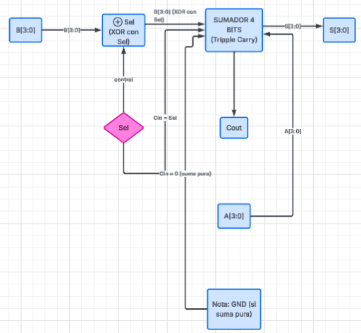
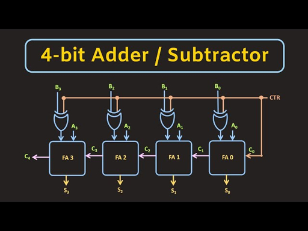
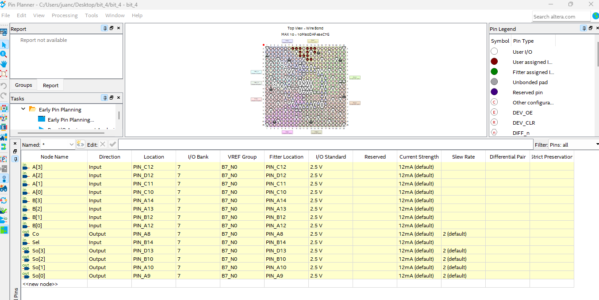
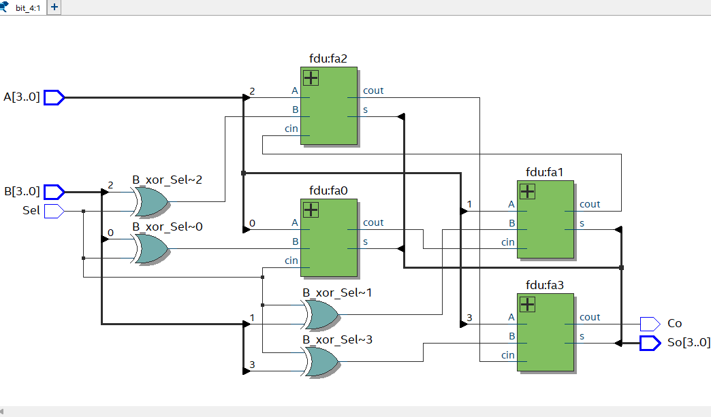
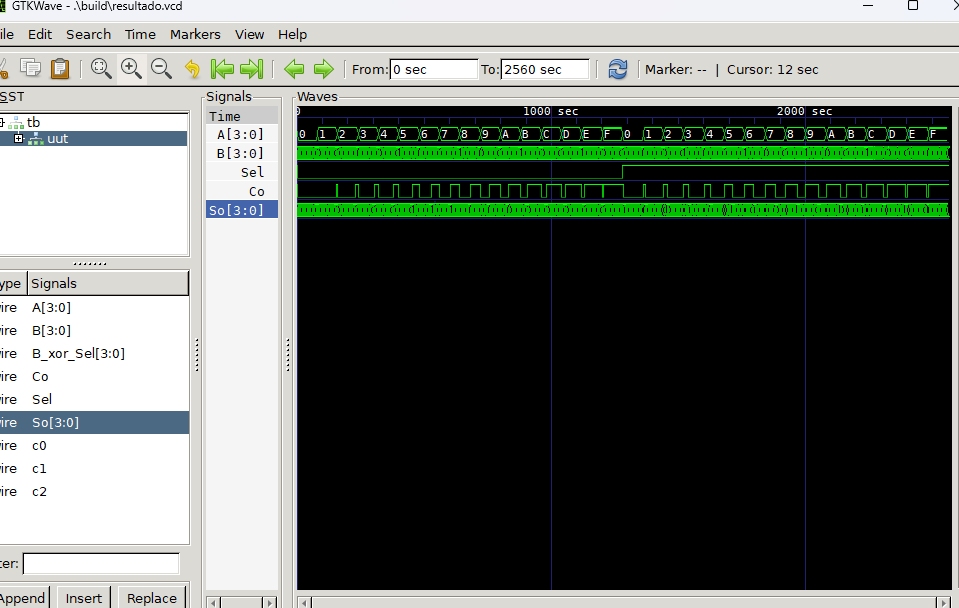
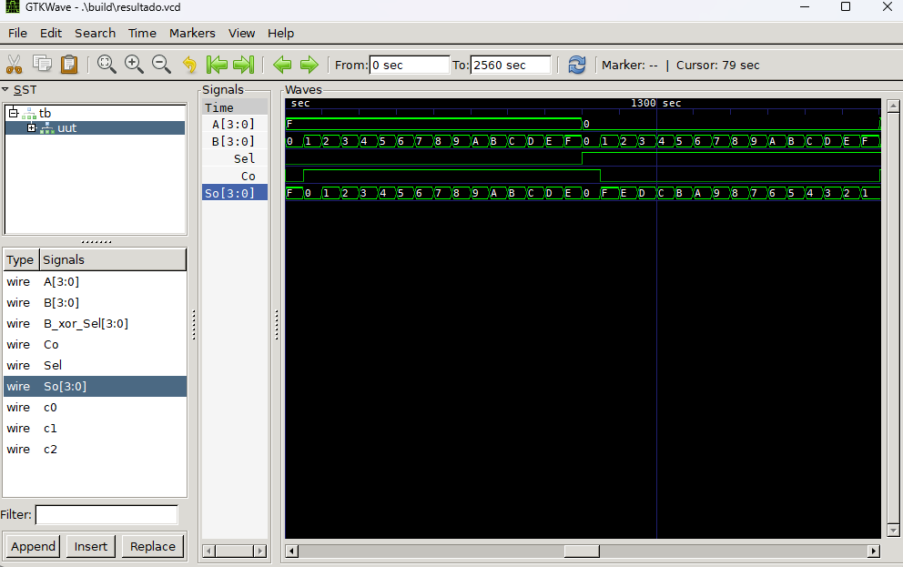

# Lab02 - Sumador/Restador de 4 bits

# Integrantes
* [Belker Andres Parra Ortega](https://github.com/belkeranparraor-hub)
* [Juan Carlos Vega Cano](https://github.com/juancavegaca-ai)
* [Juan Carlos Silva Garcia](https://github.com/juancsilvaga-eng)

# Informe

Indice:

1. [Documentación](#documentación-de-los-circuitos-implementados-implementado)
2. [Simulaciones](#simulaciones)
3. [Evidencias de implementación](#evidencias-de-implementación)
4. [Preguntas](#preguntas)
5. [Conclusiones](#conclusiones)
6. [Referencias](#referencias)

## Documentación del diseño implementado

### 1. Sumador/Restador

#### 1.1 Descripción

¿Qué se hizo exactamente?

En este laboratorio se construyo un circuito combinacional que puede sumar o restar dos números de 4 bits. La magia está en que uso el mismo sumador para ambas operaciones, solo cambiando una señal de control llamada Sel.

El secreto: Complemento a 2

Para restar A - B se hace:

A - B = A + (-B)

Y -B se calcula fácil: inviertiendo todos los bits de B y sumando 1.

Diagrama del Sumador Base (4 bits)

Sumador restador de 2 numeros de 4 bits

Primero reutilizamos el sumador que se tenía del Lab01

Cómo funciona por dentro:
Cuatro "sumadores de 1 bit" conectados en cadena (ripple carry):

    Bit 0: A0+B0+Cin → S0 + C1

    Bit 1: A1+B1+C1 → S1 + C2

    ... hasta bit 3.

    Sumador/Restador Completo

Agregamos 4 compuertas XOR y la señal Sel:

De esta manera: 

Cuando Sel=0 (SUMA):

    XOR no cambia B (B ⊕ 0 = B)

    Cin=0
    → A + B

Cuando Sel=1 (RESTA):

    XOR invierte B (B ⊕ 1 = ~B)

    Cin=1 (suma el +1)
    → A + (~B + 1) = A - B

#### 1.2 Diagramas

## Simulaciones 

### 1. Simulación del sumador/restador

#### 1.1 Descripción

El laboratorio consistió en el diseño y simulación de un circuito aritmético de 4 bits capaz de realizar sumas y restas binarias de manera eficiente. El objetivo principal fue implementar la lógica de Complemento a 2 para unificar ambas operaciones en un solo bloque funcional, optimizando el uso de componentes digitales.

Para la construcción del módulo en Visual Studio, se aplicó la propiedad matemática donde una resta $A - B$ se procesa como la suma de $A$ más el negativo de $B$:$$A - B = A + (\sim B + 1)$$El diseño se centró en dos componentes clave:Compuertas XOR: Utilizadas como inversores selectivos. Cuando la señal de control Sel es 1, invierten los bits de $B$ (obtención del Complemento a 1). Para la gestión del Acarreo ($C_{in}$): Se conectó la misma señal Sel al acarreo inicial del sumador. Esto permite que, al restar, se sume automáticamente el "1" requerido para completar el paso al Complemento a 2.

El circuito opera bajo una lógica binaria dependiente de la entrada de control (Sel):Modo Suma (Sel = 0): El número $B$ pasa sin cambios a través de las XOR y el acarreo inicial es 0. El resultado es $A + B$.Modo Resta (Sel = 1): Las XOR invierten a $B$ y el acarreo inicial es 1.

 El circuito ejecuta $A + \text{comp2}(B)$, permitiendo obtener resultados negativos representados correctamente en formato de complemento. La implementación demostró que es posible simplificar el hardware (o la lógica de programación) reutilizando un sumador estándar para realizar restas. Se validó que el bit de acarreo final ($C_o$) sirve como indicador del signo y la magnitud del resultado, confirmando que el complemento a 2 es el estándar más eficiente para la aritmética digital actual.

#### 1.2 Diagramas

El proyecto se basó en la optimización de recursos aritméticos mediante la técnica de Complemento a 2. El diseño permitió unificar las operaciones de suma y resta en un solo bloque funcional, utilizando la propiedad matemática $A - B = A + (\sim B + 1)$.Para la implementación, se integraron compuertas XOR que actúan como inversores controlados: Modo Suma ($Sel = 0$): El dato $B$ pasa íntegro y el acarreo inicial ($C_{in}$) es 0.Modo Resta ($Sel = 1$): Las XOR invierten los bits de $B$ (Complemento a 1) y el bit $Sel$ se introduce al $C_{in}$ del primer sumador, sumando el "+1" necesario para completar el Complemento a 2. 
En Visual Studio & GTKWave, antes de la transferencia al hardware, se realizó una verificación funcional rigurosa. Utilizando un testbench en Visual Studio, se generaron estímulos para cubrir casos críticos de la aritmética binaria. Los resultados se analizaron en GTKWave, donde se validó que las formas de onda de los sumadores internos, los acarreos intermedios ($C_{out}$) y el resultado final coincidieran con los cálculos teóricos esperados, garantizando un diseño libre de errores lógicos. Para la implementación Física y Configuración (FPGA MAX 10)La fase final consistió en la síntesis y carga del diseño en la FPGA Intel 10M50DAF484C7G. Un paso crucial fue la utilización del Pin Planner, donde se asignaron las señales lógicas a los recursos físicos de la placa: Entradas: Los Switches (SW) se mapearon para representar los operandos $A$, $B$ y la señal de control $Sel$.Salidas: Los LEDs se configuraron para visualizar el resultado binario y el estado del acarreo de salida ($C_o$).
La implementación en hardware demostró una fidelidad del 100% respecto a la simulación. Se comprobaron casos prácticos directamente en la tarjeta:Ejemplo Positivo ($7 - 5$): Al configurar los switches, se obtuvo 0010 (2 decimal) en los LEDs, con el bit de acarreo en 1, validando un resultado positivo. Ejemplo Negativo ($3 - 7$): Se obtuvo 1100, que corresponde a $-4$ en complemento a 2, con un acarreo de 0.

## Evidencias de implementación

<video src="video 1.mp4" controls width="500"></video>

## Conclusiones

*  Se demostró que el uso del complemento a 2 es la estrategia más eficiente para el diseño de sistemas digitales, ya que permite reutilizar la arquitectura de un sumador completo para realizar restas, reduciendo significativamente la cantidad de compuertas lógicas necesarias.
* Se validó experimentalmente el rol de la compuerta XOR como un inversor programable. Su capacidad para dejar pasar el dato original (cuando $Sel=0$) o invertirlo (cuando $Sel=1$) es fundamental para el control de flujo de datos en unidades aritméticas.
*  La coincidencia exacta entre los cronogramas obtenidos en GTKWave y el comportamiento físico de los LEDs en la FPGA Intel MAX 10 confirma la importancia de una fase de testbench rigurosa antes de la implementación en silicio.
*  Se comprobó que el bit de acarreo final ($C_o$) es un indicador clave: en operaciones de resta, un $C_o = 1$ indica un resultado positivo, mientras que un $C_o = 0$ indica que el resultado es negativo y está representado en complemento a 2.

## Referencias

1. **Mano, M. M., & Ciletti, M. D. (2018).** *Digital Design: With an Introduction to the Verilog HDL, VHDL, and SystemVerilog*. Pearson. (Capítulo 4: Aritmética Binaria).
2. **Intel Corporation.** *MAX 10 FPGA Device Architecture Guide*. Recuperado de [intel.com](https://www.intel.com).
3. **Floyd, T. L. (2015).** *Fundamentos de Sistemas Digitales*. Pearson/Prentice Hall.
4. **Harris, D., & Harris, S. (2012).** *Digital Design and Computer Architecture*. Morgan Kaufmann.